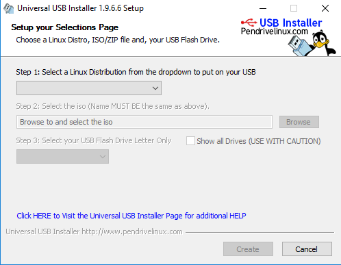
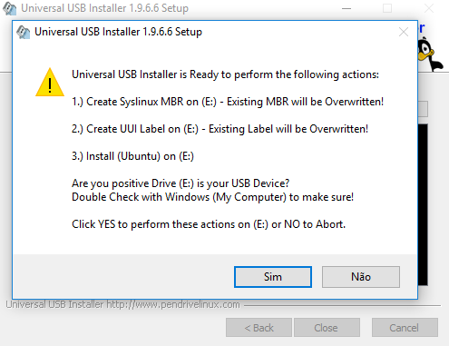
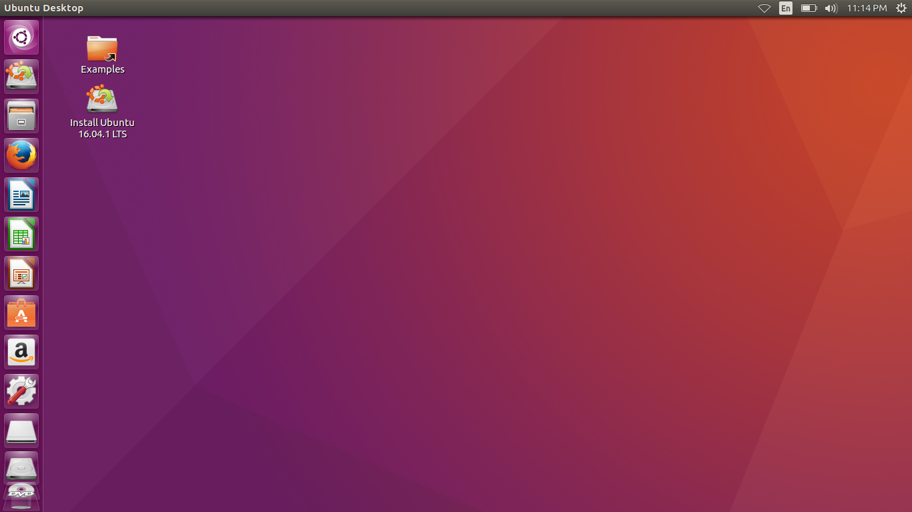

Title: Tutorial: Pendrive bootavel com Linux e memória persistente
Date: 10-10-2017
Category: tutoriais
Tags: linux, pendrive bootavel, ubuntu
Slug: LinuxPersistente
Author: Matheus O. Santos
Summary: Hoje, vou mostrar para vocês como instalar uma distribuição linux com memória persistente. Bem, já vou avisando que o programa que vou usar hoje, pode não ser compátivel com todas as distribuições...

Hoje, vou mostrar para vocês como instalar uma distribuição linux com memória persistente. Bem, já vou avisando que o programa que vou usar hoje, pode não ser compátivel com todas as distribuições, mas para isso há outro programa chamado LiLi USB que talvez, TALVEZ, funcione a distribuição que você queira, por enquanto são os únicos que eu conheça. Mas se souber de mais algum, falo aqui e faço outro tutorial.
  
O que precisaremos para a realização do projeto. Precisaremos do Universal-USB-Installer e um pendrive eu recomendaria um no mínimo de 4 GB e eu usarei um com esse tamanho. Primeiro baixe o Universal-USB-Installer  <a href="http://www.pendrivelinux.com/downloads/Universal-USB-Installer/Universal-USB-Installer-1.9.6.8.exe" style="text-decoration:none">aqui</a> Ele não é um aplicativo que precisa ser instalado para usar ele, basta apenas abrir ele após baixar. Abra o aplicativo. E você terá uma tela com um tela com o acordo de licença (license agreement). Clique em "I Agree" para continuar. Depois disso você terá essa tela:
  

  
Clique aqui e selecione sua distro. Eu usarei a do ubuntu:
  

   
Ao clicar aparecerá isso. Clique em Browse e selecione onde sua distro está 
  

  
Depois de selecionar sua distro é a hora de você escolher o pen drive que você usará
  

  
Após você escolher o pen drive, se sua distro tiver suporte nesse programa. Aparecerá a opção abaixo, nessa opção você pode escolher o tamanho da sua memória que servirá para guardar suas configurações, músicas e etc. Eu escolherei 500 MB.
  

  
Após isso clique em create e aparecerá essa tela dizendo 
1)Criar sistema Linux Master Boot Record (MBR)- MBR existentes serão sobrescritos 
2)Criar UUI label no [E:]- Labels existentes serão sobrescritos 
3)Instalar Ubuntu no [E:] 
Você tem certeza que o dispositivo [E:] é seu? 
Checagem dupla com windows (meu computador) para ter certeza 
Clique SIM para fazer essas ações e clique em NÃO para abortar. 
Clique em sim para instalar.
  

  
E ela começará:
  

  
Ao terminar clique em close e pronto sua distro com memória persistente está pronta! Apenas reinicie seu computador e use-a. Caso não funcione altere a ordem do boot na bios, e caso mesmo assim não funcione, que provavelmente será o caso da versão do Windows 8 e Windows 10. Segure SHIFT, e clique em reiniciar, irá aparecer uma tela dizendo "Selecione uma opção". Clique em "Use um dispositivo". E depois selecione a primeira opção e pronto, irá fazer o reboot. Ao reiniciar ele entrará no menu grub. Esse menu grub terá várias opções, e se atente a elas. Você tem que clicar em "try *o nome da sua distribuição* whitout installing".
  
Divirta-se
  

 
