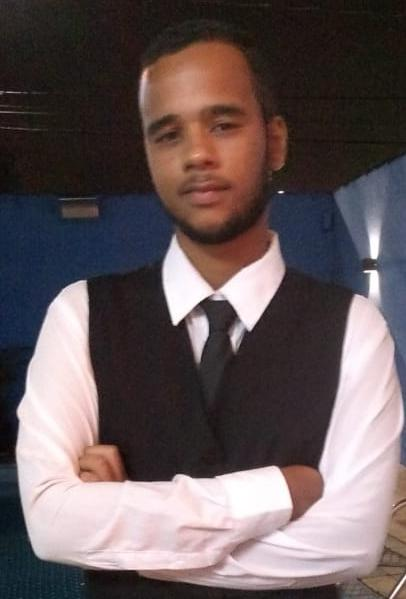

Title: Sobre
Slug: Sobre

<h2><a name=quemEuSou style="text-decoration:none"  id="postagensTitulo" >Quem eu sou</a></h2>
 

<figure style="float:left;padding: 0 10px 10px 0">
</figure>Formado Técnico em Informática na ETEC, pelo Centro Paula Souza.    Sou apaixonado por informática desde que eu era pequeno, e sei que é isso que quero para vida, atualmente meus planos são atuar na área de informática e fazer uma faculdade de Ciência da Computação ou Análise e Desenvolvimento de Sistemas. 

<h2><a>Escolaridade</a></h2>

Ensino médio concluido com sucesso!  

<b>Escola:</b>

<progress max="100" value="100" style="width:250px"></progress>

<h2 id="postagensTitulo"><a>Programação</h2></a>

<strong>C#:</strong> Conhecimentos em desenvolvimento desktop usando Windows Form Application, implementação
do Banco de Dados junto com as operações básicas e utilização das classes de Thread e IO.

<strong>Java:</strong> Desenvolvimento desktop na criação de formulários, ligação com o Banco de Dados usando a
biblioteca JDBC e a criação de relatórios usando a ferramenta iReport.

<strong>PHP:</strong> Realização de operações básicas da linguagem e a ligação com formulários em HTML.

<strong>MySQL:</strong> Noções intermediárias na criação de Banco de Dados, utilização de Inner Join, Trigger e
Procedures

<strong>Mobile:</strong> Habilidades básicas de desenvolvimento utilizando C# e Axml e ligação com Banco de Dados
utilizando SQLite.

<strong>HTML:</strong> Conhecimento intermediário na criação de páginas web.

<strong>CSS:</strong> Conhecimento básico na confecção de páginas web.

<strong>Pacote Office:</strong> Habilidades avançadas na criação de documentos utilizando Word e Power Point.
Conhecimento intermediários na criação de Banco de Dados utilizando Access, tais como utilização de
macro, criação de formulário e relacionamentos.

<strong>Línguas:</strong> Inglês Intermediário, Português nativo

<h2><a>Projetos</h2></a>

Tenho alguns projetos feitos durante o tempo que estava estudando na Etec, os projetos são na maioria de programas desktop feito para administração de comércios. Porém eles deram noção de desenvolvimento desktop e das linguagens que aprendi. Você pode encontrar meu repositório com os projetos <a href="https://github.com/somatheus/Projetos">aqui</a>
