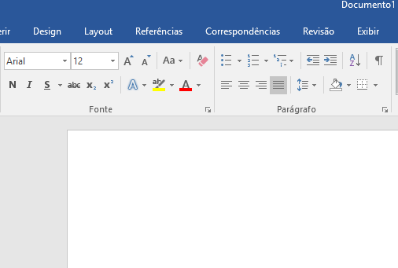
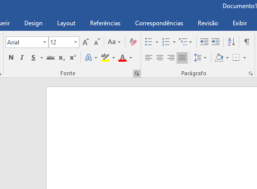
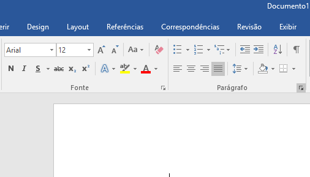
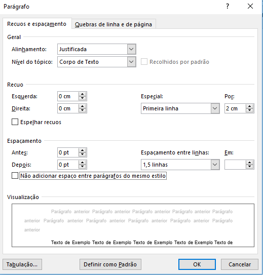
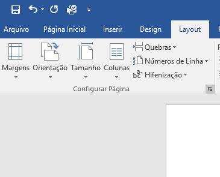

Title: Tutorial: Word com a formatação padrão ABNT
Date: 10-15-2017
Category: tutoriais
Tags: word, abnt, formtacao
Slug: wordAbnt
Author: Matheus O. Santos
Summary: Quem nunca teve que formatar um trabalho nas normas ABNT pela primeira vez, não sabe o que é sufoco, e quem nunca teve que fazer diversos trabalhos e lembrar da norma nem se fale. Mas você sabia que há uma maneira de você padronizar as suas formatações? E é bem simples, ensinarei para vocês hoje, como padronizar um documento na forma que vocês quiserem...

Isso parece sempre uma daquelas tarefas impossíveis de que quando o professor passa você fica bravo e tudo mais, mas é tudo uma questão de prática. As normas ABNT, não são tão ruins assim depois que você conhece ela. Mas admito que é horrível ficar formatando sempre. Se atente a esse tutorial e você não terá mais problemas com isso

Primeiro de tudo abra obviamente o Word.Para esse primeiro passo, vamos precisar apenas desse elementos. 

Clique naquela seta pequena no canto.
  

  
Abrirá essa janela aqui. Altere a fonte para "Arial". O estilo da fonte para "normal".O tamanho para "12" e clique em "Definir como padrão". 
  

  
Ao clicar aparecerá a mensagem abaixo. Ao aparecer, selecione a segunda opção e aperte "Ok"
  

  
Você voltará para a tela inicial do documento, agora é hora de selecionar a mesma setinha na parte de "Páragrafo"
  

  
Irá aparecer uma janela parecida a da anterior. Deixe o alinhamento como "justificado" o nível do tópico como "corpo de texto"(a não ser que isso seja para titulo se você estiver fazendo a formatação para um título deixe como título 1. Apenas os textos tem que ficar como "corpo de Texto"). Deixe especial como "primeira linha Por 2 CM". E o espaçamento entre linhas como "1,5". Deixe os valores que sobraram como 0. Ao terminar, clique em "Definir como padrão" e depois selecione a segunda opção que é "Todos os modelos baseados no modelo normal .dotm?"
  

  
Feito isso vá na guia "Layout" e na aba de "Configurar Página". Clique na mesma setinha.
  

  
Abrirá uma janela igual a das outras. Nela deixe "Superior" e "Esquerda" com "3 CM" e "Inferior" e "Direita" como   "2 CM". 
  

   
E depois aperte "Definir como Padrão". Aparecerá uma mensagem aperte "Sim" nela
  

  
Após ter feito tudo isso, as configurações de texto, e margem, irão ficar salvas como padrão e todos os documentos ficarão desse jeito.
 
